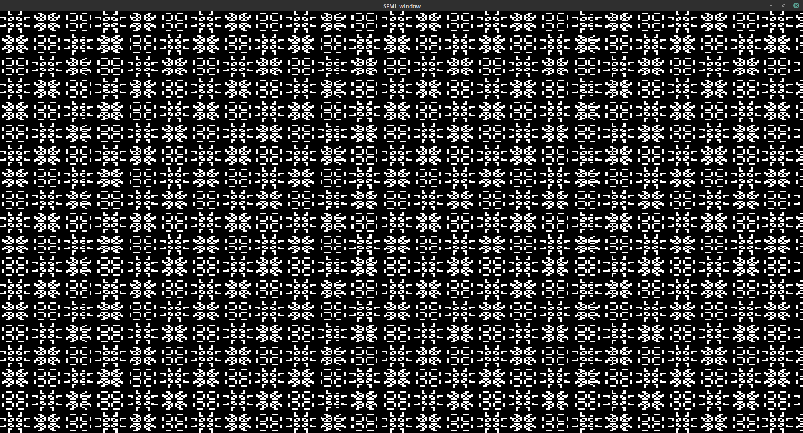

# Life++

This is an optimized implementation of Conway's Game of Life.

I was challenged during my internship to write a version of [barnex/life](https://github.com/barnex/life) using C++
instead of Go. One year later, I eventually took a stab at it. Here is the result.

Using the example program, I was able to measure the time to simulate 10000 generations on a 512x512 grid. It
consistently takes 662.336ms. This comes to roughly 4 billion cells per second.
I used a AMD Ryzen 7 1700 (16) @ 3.100GHz so one could calculate that on average we simulate 1.3 cells per CPU cycle.

For reference, the Go code could achieve around 1.0 cells per cycle. So not really much of a bonus, but it still counts.